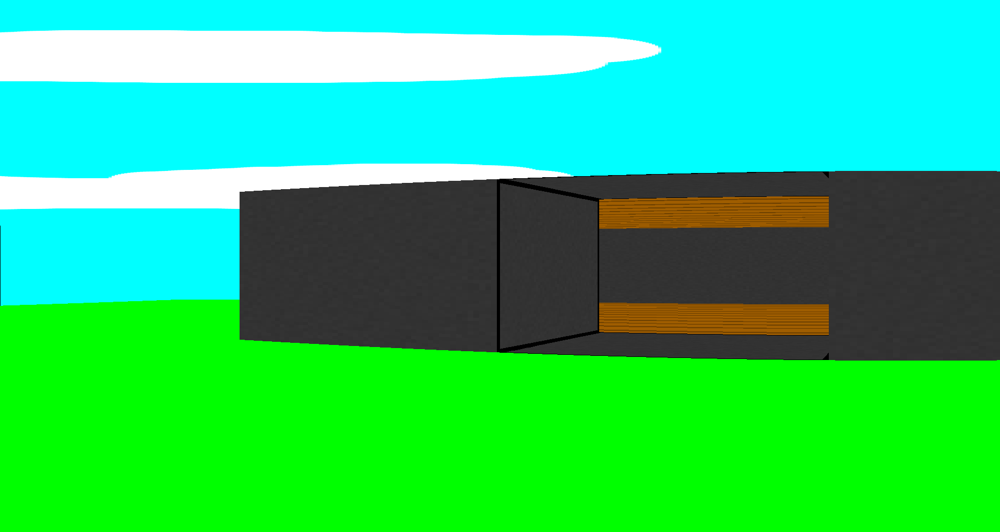
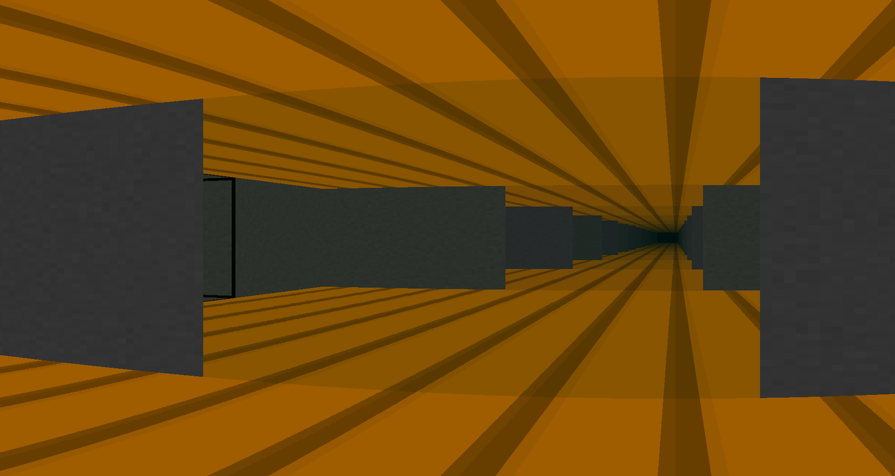
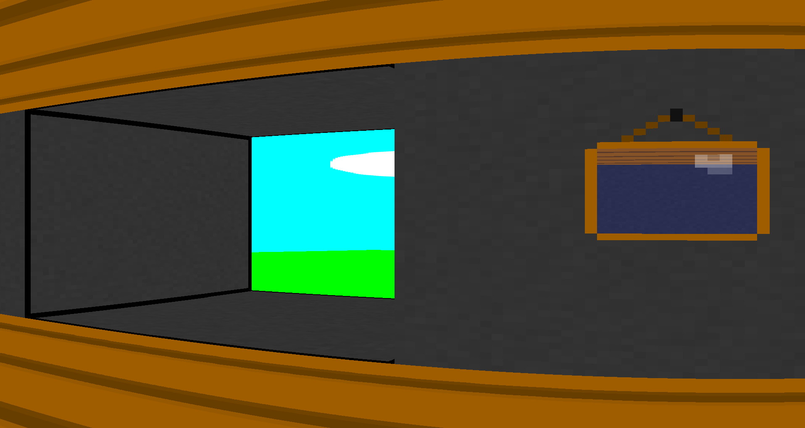

# Pseudo3D Engine

C++, OpenGL 3.3, [stb_image](https://github.com/nothings/stb), [GLEW](https://github.com/nigels-com/glew)

For testing: [SFML](https://github.com/SFML/SFML)

# About the Project

Have you ever wondered how beautiful pseudo-3D can be? It is not only about looks — it also uses fewer computer resources. With some tricks, it may not be easy to see that the whole map is actually 2D.

My `pseudo3d_engine` library lets you create a 2D map made of walls and render it in pseudo-3D. The library is still in development, but it already supports: mirrors, transparency for wall textures, portals that can lead to another map, textured floors and ceilings (or a sky) and some other small features

<!-- link to wiki:example -->

# Compatibility

The library is based on OpenGL, so it may work on any operating system that supports graphics. However, it has only been tested on Linux so far.

# How to Install

You will need `cmake`, `make`, and `gcc`.

First, download the project either from [this link](https://github.com/3NikNikNik3/pseudo3d_engine/archive/refs/heads/main.zip) or by using Git:

	git clone https://github.com/3NikNikNik3/pseudo3d_engine.git

Then run:

	cmake -Bbuild

By default, the library is installed in `/usr/local`. If you want to install it in another folder, add `-DCMAKE_INSTALL_PREFIX=dir`.

For example:

	cmake -Bbuild -DCMAKE_INSTALL_PREFIX=/usr

Finally, run:

	cd build
	make install

That's it! You can now delete the `pseudo3d_engine/` folder.

<!-- link to wiki:build -->

# Other language

[Russion] (https://github.com/3NikNikNik3/pseudo3d_engine/blob/main/ReadMe_ru.md)